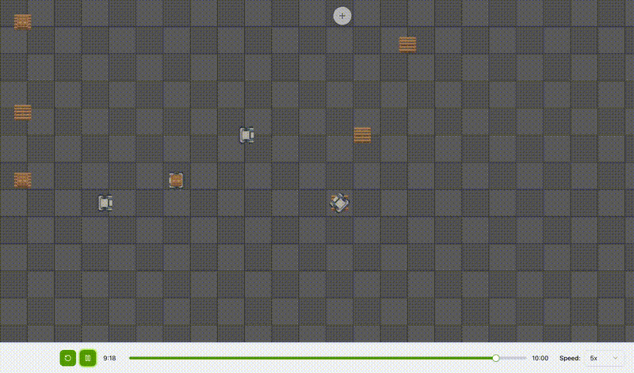

# DEStiny

**DEStiny** is a discrete event simulation engine built on top of [SimPy](https://simpy.readthedocs.io/). It extends SimPy by adding a standardized layer for **recording simulation events** (such as movement) which can then be visualized in a companion frontend application.

This repository is a **monorepo** containing both the simulation engine and the visualization frontend.

## Project Structure

- **[Engine](src/engine/README.md)** - The Python simulation engine (`destiny-sim` package)
- **[Frontend](src/frontend/README.md)** - The React/Next.js web application for visualizing simulations

## Quick Links

- 📦 [Installation & Usage](src/engine/README.md#installation) - Get started with the Python engine
- 🎨 [Visualization Viewer](https://destiny.deusxmachina.dev/) - Web-based simulation viewer
- 📚 [Examples](src/engine/src/examples) - Example simulations
- 🚀 [Frontend Development](src/frontend/README.md) - Frontend setup and architecture

## License

MIT License
