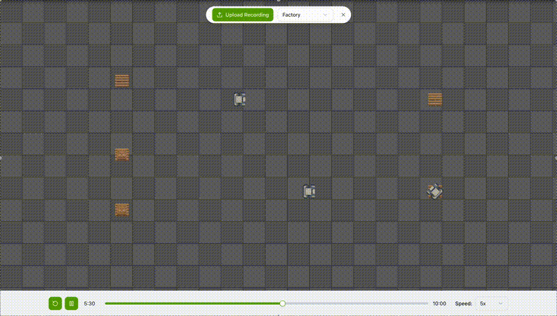

# DEStiny Frontend



The **DEStiny Frontend** is a web application for visualizing discrete event simulation recordings generated by the [DEStiny simulation engine](../engine/README.md).

Upload a simulation recording JSON file and watch your agents, AGVs, and processes come to life with real-time controls, speed adjustment, and frame-perfect playback.

👉 **[Try it live at destiny.deusxmachina.dev](https://destiny.deusxmachina.dev/)**

## Quick Start for local setup

### Prerequisites

- [Bun](https://bun.sh/) (recommended) or Node.js 18+

### Installation

```bash
cd src/frontend
bun install
```

### Development

```bash
bun dev
```

Visit `http://localhost:3000` to see the app running.

#### Auto-loading Dummy Data (Development Mode)

In development mode, you can automatically load dummy data by setting the `NEXT_PUBLIC_DEBUG_DUMMY_FILE` environment variable. Create a `.env.local` file in the `src/frontend` directory:

```bash
# .env.local
NEXT_PUBLIC_DEBUG_DUMMY_FILE=grid_fleet_recording.json
# or
NEXT_PUBLIC_DEBUG_DUMMY_FILE=bank_renege_recording.json
```

The app will automatically load the specified dummy data file on startup, eliminating the need to manually upload recordings during development.

### Building for Production

```bash
bun run build
bun start
```

### Tech Stack

- **Framework**: Next.js 14 (App Router) with React 19
- **Visualization**: PixiJS 8.x + `@pixi/react`
- **Components**: shadcn/ui + Tailwind CSS
- **Language**: TypeScript (strict mode)
- **Runtime**: Bun or Node.js 18+

## Adding New Entity Types

To visualize a new entity type, add its sprite to `public/assets/` and update the sprite mapping:

```typescript
// In SimulationEntity.tsx
const SPRITE_MAP: Record<SimulationEntityType, string> = {
  human: "/assets/human.png",
  agv: "/assets/agv.png",
  box: "/assets/box.png",
  // Add your new type:
  robot: "/assets/robot.png",
};
```

Then use it in your Python simulation:

You will also need to manually add it there and then:

```python
class Robot(SimulationEntity):
    def get_rendering_info(self) -> RenderingInfo:
        return RenderingInfo(entity_type=SimulationEntityType.ROBOT)
```

## Roadmap

We're just getting started with the frontend. Planned improvements:

- **Real-time metrics overlay**: View KPIs during playback
- **Multiple recordings comparison**: Side-by-side scenario analysis
- **Custom sprite upload**: User-provided assets without code changes
- **Export to video**: Generate MP4s for presentations
- **Interactive editing**: Modify scenarios directly in the UI
- **Collaborative features**: Share and comment on recordings

We'd love to hear what features matter most to you. Open an issue or PR!

## License

MIT License
